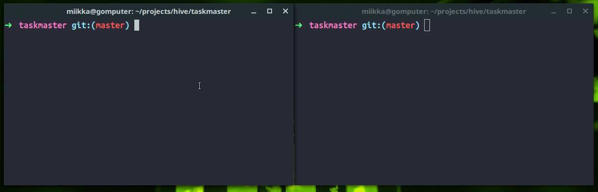

<h1 align="center">
	(WIP) Taskmaster
	<br><br>
	
</h1>

## How it works

Screencast with [example config](#Example-config)

<p align="center">
	
</p>

## Features

### Client
- :heavy_check_mark: UI with raw mode
- :heavy_check_mark: History
- :heavy_check_mark: *Autocompletion* for commands and **task names**
- :heavy_check_mark: Aliases
- :heavy_check_mark: Sends user input to server via TCP

### Server (daemon)
- :heavy_check_mark: Option to daemonize with `-d` flag
- :heavy_check_mark: Hot-reloads config file when receives `SIGHUP` signal
- :heavy_check_mark: Only one client at time is allowed
- :heavy_check_mark: Server remains listening for a new client if client exits
- :heavy_check_mark: Sends new job names to client when needed for suggestions

## How To Use

### Keys
| Key | Action |
|---------|---------|
| <kbd>**Up**</kbd> | Next history item |
| <kbd>**Tab**</kbd> | Next suggestion (autocomplete) |

### Commands
| Command (alias) | Action |
|---------|---------|
| <kbd>**help** (h)</kbd> | Show help |
| <kbd>**status** (st)</kbd> | show job statuses |
| <kbd>**start** (run)</kbd> | start a job |
| <kbd>**stop** (pause)</kbd> | stop a job |
| <kbd>**restart**</kbd> | restart a job |
| <kbd>**reload**</kbd> | reload config file |
| <kbd>**uptime**</kbd> | show uptime of process |
| <kbd>**fg**</kbd> | attach output to servers stdout |
| <kbd>**bg**</kbd> | deattach output from servers stdout |

### Example config
```json
{
	"realtime": {
		"command": "bash /home/miikka/projects/hive/taskmaster/assets/test.sh",
		"workingDir": "./assets",
		"startTime": 5,
		"numprocs": 1,
		"autostart": false,
		"autorestart": true,
		"stdout": "/tmp/realtime.log"
	},
	"failing": {
		"command": "notfound",
		"startTime": 2,
		"stopTime": 7,
		"numprocs": 1,
		"autostart": true,
		"autorestart": true,
		"stdout": "/tmp/failing.log"
	}
}
```

## TODO
- [x] Job names to client (suggestions)
- [ ] Windows support if i get windows machine
- [ ] Refactor bad parts
- [ ] Logger
- [ ] Stop signal
- [ ] Process pool
- [ ] Send fg to client
- [x] Implement commands nicely [(result)](https://github.com/tuommii/Taskmaster/commit/41c430f1a634154d0f7831dc5001c05646a74bc4#diff-4c51d95b26718af4a2ac3bec33e54e49L128)
- [ ] Get config file via arg
- [ ] Config validation (check max lengths also)
- [ ] Validate restarting processes
- [ ] Remove x-packages
- [ ] Mutex ?
- [ ] Multiline support
